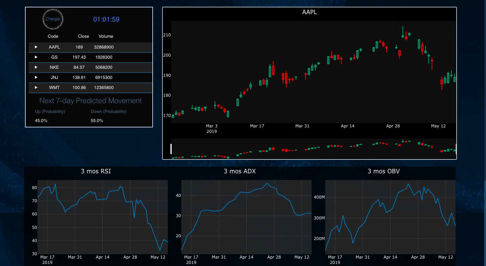
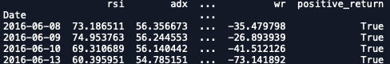
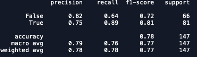

# TechDex
A machine learning stock movement prediction model based only on popular technical indicators. **Note: this is a partially open sourced project.** More specifically, the database and pretrained machine learning models are not available here. However, I have kept the ETL and trainer class, so you can always train your own model based on assets of your interest.

I have deployed a working version to heroku. [explore the app](https://techdex-chenjie.herokuapp.com/)

This project aims to use only market data and technical indicators to predict stock returns. *Why only techinical indicators? Because foundamental data are hard to acquire at a scale of training machine learning models!* Nevertheless, we have obtained satisfying result on which we can leverage to get profit according to the law of large numbers.

We wish to formalize the problem as a supervised learning classification problem. Given a set of technical indicators at a point of time for some asset, we want to have a model which can predict whether the asset price is going up or down in the next 7-days.

**Data Preparation:** We use three year daily stock market data. First compute six techincal indicators, trend indicator: [ADX](https://en.wikipedia.org/wiki/Average_directional_movement_index), momemtum indicators: [RSI](https://en.wikipedia.org/wiki/Relative_strength_index), [MFI](https://en.wikipedia.org/wiki/Money_flow_index), and [William%R](https://en.wikipedia.org/wiki/Williams_%25R) volume indicators: [OBV](https://en.wikipedia.org/wiki/On-balance_volume), [VPT](https://en.wikipedia.org/wiki/Volume%E2%80%93price_trend). **Now next step is very importance** transform data into supervised learning shape (X, y), where y is the **sign** of the next 7-day returns, and then randomly shuffle the dataset. Machine learning models usually have *i.i.d.* sample assumption, doing this is to help us break the auto-correlations among time series data points. 
Now, we are almost ready, split the data into training, and testing set (30% of the data points).

**Model Selection:** I choose the base classifier to be random forest, as tree-based models are robust against unnormalized feature values. For example, RSI is of scale 0-100, whereas VPT is often of millions. This can be a huge issue for many machine learning models, as the features would be treated unevenly. Of course, the safest way is to normalize feature values into the same scale. Next, we do random grid-search on a hyperparamter space, and use 5-fold cross-validation result to select the model with the mimimum generalization error. Finally, we examine the selected model on the test data.

